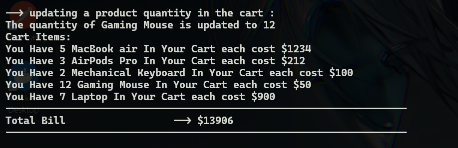
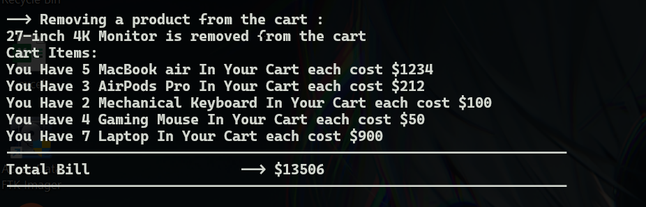
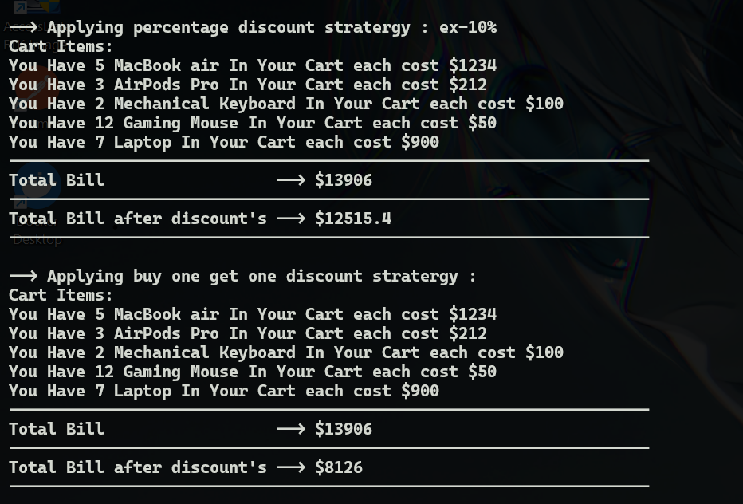

# E-commerce-Cart-System - (Documentation)

# Problem Statement

Develop a simple E-commerce cart system where users can add products to their cart, update quantities, and view the total bill. Products
should have attributes like name, price, and availability status.
Functional Requirements

1. Display a list of products with their attributes.
2. Allow users to add products to the cart.
3. Implement cart functionality where users can view, update quantities, and remove items.
4. Calculate and display the total bill.

# Solution :

This is a terminal based e-commerce cart system with various functionalities such as display-items , add-to-cart , remove from cart , discounts , update-quantity etc .

# Steps to run the code :

1. Download or clone the repository
2. Two options for simulation :

   1. <h3>**User input based** : run file -> main_user_input_based.cpp</h3>
      1.input is provided by user for the product he want and in what quantity he wants.
      2.Does he want to update the quantity of the product ?
      3.Does he want to remove any product from cart ?
      4.After all this , if the bill >= 1000 and < 5000 --> 10% discount.
      5.if the bill >= 5000 then buy one get one free discount.

   2. <h3>**On predefined Input** : **run file -> main_predefined_input_based**</h3>
      1.here input is already provided in the code which can be modified for test.
      2.adding item to cart
      3.updating item from cart
      4.removing item from cart
      5.applying both discount stratergy 1. percentage discount 2. buy-one-get-one free discount

# Edge cases handeled :

    1. The products cannot have negative price in store
    2. The product cannot be added to cart if the availablity status is false
    3. The product quantity cannot be updated if the product is not in cart
    4. The product quantity cannot be updated to a negative number
    5. Product cannot be removed from the cart if it is not present
    6. The percentage discount cannot be <0 and >100
    7. Buy one get one free discount only works when there are more the 2 item of same product
    8. The product cannot be added to cart which is not in list

# Screenshot's Of Simulation :

<h3>1. **On predefined Input** : **File -> main_predefined_input_based</h3>

1.  product list :
    

2.  cart view
    

3.  updating
    

4.  removing
    

5.  cart after aoolying discounts
    

**2. **User input based** : **File -> main_user_input_based.cpp\*\*\*\*

1.  product list view
    

2.  user input cart items
    

3.  user removing a product from cart
    

4.  user updating the quantity of an item from cart
    

5.  discount for user based on how high the bill amount is
    

6.  final cart view with final bill with applied discount
    
